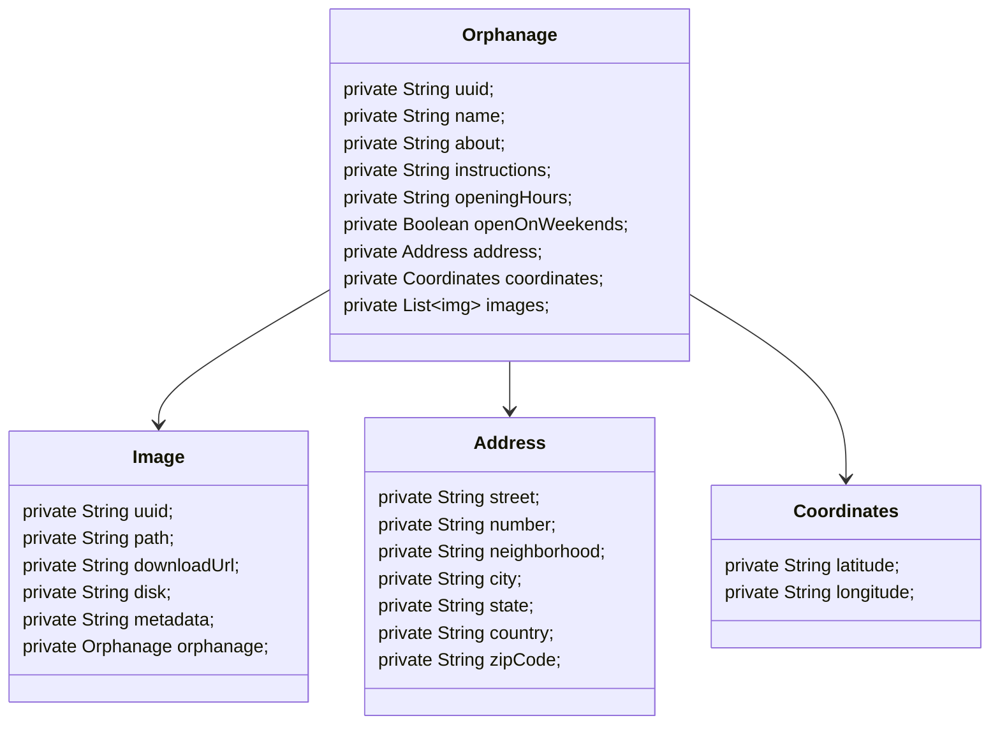

## Happy API - Java Version

This is the Java version of the [Happy API](https://github.com/isaquesb/happy-api) project.

### DIO Design Patterns Challenge

Original Repository: [Design Patterns with Spring](https://github.com/digitalinnovationone/lab-padroes-projeto-spring)

Applied pattern list:

- Chain of Responsibility (for create orphanage)
- Factory Method (for create orphanage and images resources)
- Abstract Factory (for create image)

### Class Diagrams

